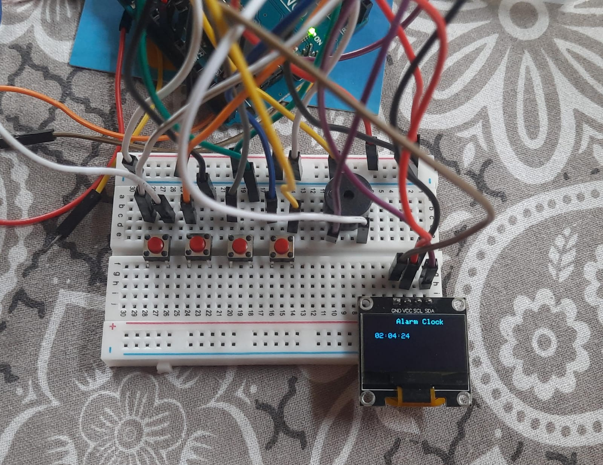

# Alarm Clock Using Arduino

## Working 

<b>The alarm clock is a simple project that uses an Arduino board to create a digital alarm clock.

<B> We Set the Time Using the Time Set[3rd button from left] & Hr[1st Button from left] or Min[2nd button from left] to set our desired time on which we want our Clock to work on 
 
And Then we use Alarm Set[4th button from left] &  Hr[1st Button from left] or Min[2nd button from left] to set our time on which we want to set off the Alarm

[Working Video](https://youtu.be/FyzLXWyv_0Y?si=rIHmtsyXhOoqSvDV)

## Components Used 

<ul>
<li>Arduino Uno R3</li>
<li>Push button (4 piece)</li>
<li>OLED Screen</li>
<li>Buzzer</li>
<li>Jumper Wire(Male to Male)</li>
<li>Breadboard</li>
<li>9v battery or From Comp </li>

